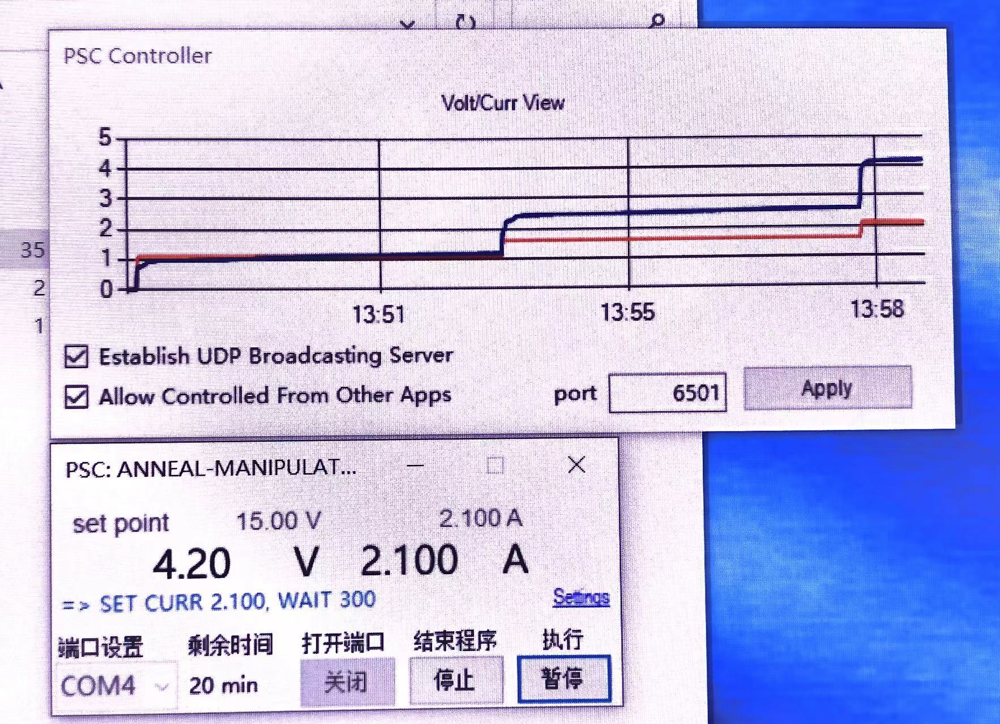

# Power Supply Controller(PSC) & PSC script generator

Power Supply Controller(PSC) is a tool for controlling the workflow of changing current or voltage.
Instead of spending much time on changing the current or voltage very often, this software allows the user to write their commands in a script and execute them consequently.

注意⚠️ 需要将电源通信波特率设置成19200.
注意⚠️ 实践中可能出现的问题，请参考issues.

https://github.com/CoccaGuo/POWER-SUPPLY-CONTROL/issues

https://github.com/CoccaGuo/POWER-SUPPLY-CONTROL/issues/1
	
> The Controller is Wanptek WPS3010H (30V10A) with a special USB connector which may be added according to the request.

> The Controller was bought from Taobao.



## Releases

https://github.com/CoccaGuo/POWER-SUPPLY-CONTROL/releases

VER 2.0.0

- 增加了图表功能
- 增加了UDP服务器功能，可以从其他程序获得信息
- [debug]增加了端口选择功能
- [debug]增加了允许外部程序控制功能

VER 2.1.0

- 增加了端口选择功能

- 增加了允许外部程序控制功能

- 设定了UDP通信应有之8位byte结构

  2.1.1

  - 修复了初始段口不显示问题
    2.1.2
  - 修复了暂停后剩余时间还在减少的bug
    2.1.3
  - 修复了无法实际控制电流源的bug
  - 修复了开始界面会显示两个COM1的bug

这将是2.0版本的最后一个主要更新，大概也是程序此后的主要维护版本，因为其功能已经完备。
上一个稳定版本是v1.5.1和v1.4.0	

## The script

The script show look like this:
	
```
	# 一个简单的电源脚本示意 a simple demo script
	# 使用PSC加载该脚本运行 use PSC to load it
	# 使用井号注释 use # to comment
	# author: CoccaGuo 
	# date: 2022.3.30
	# Comment should begin from the first line
	# 注释应另起一行书写
	# 识别标识符 不要删除下面这行字符  keep the line below as the first line
	
	PSC SCRIPT
	
	# 程序名 script name
	FUNC demo
	
	# 设置电压 set voltage
	SET VOLT 5.00
	# 设置电流 set current
	SET CURR 1.00
	# 开始输出 open output
	SET OUTPUT 1
	# 等待秒数 wait some seconds
	WAIT 1200
	
	# 关闭输出 close output
	SET OUTPUT 0
	# 脚本结束
	END
```

You can also use the generator to generate scripts. A generated one should look like this:
	
```
	
	# Automatic power supply script generated on 2022/4/6 14:24:52. Check before use.
	PSC SCRIPT
	
	func count_down
	# Functional test and preparation. DO NOT CHANGE.
	set volt 1
	set curr 0.05
	set output 1
	wait 5
	set output 1
	wait 5
	# test over.
	
	# loop begin.
	
	#loop #0
	set volt 1.000
	set curr 0.050
	wait 5
	
	#loop #1
	set volt 0.900
	set curr 0.050
	wait 5
	
	#loop #2
	set volt 0.800
	set curr 0.050
	wait 5
	
	#loop #3
	set volt 0.700
	set curr 0.050
	wait 5
	
	#loop #4
	set volt 0.600
	set curr 0.050
	wait 5
	
	#loop #5
	set volt 0.500
	set curr 0.050
	wait 5
	
	#loop #6
	set volt 0.400
	set curr 0.050
	wait 5
	
	#loop #7
	set volt 0.300
	set curr 0.050
	wait 5
	
	#loop #8
	set volt 0.200
	set curr 0.050
	wait 5
	
	#loop #9
	set volt 0.100
	set curr 0.050
	wait 5
	
	set volt 0
	set curr 0.05
	wait 5
	
	# End loop. Stopping power supply.
	
	set output 0
	wait 5
	set volt 0
	set curr 0
	set output 0
	end
	
	# End of the script.
	# Powered by Coccaguo. Version 0.1

```
